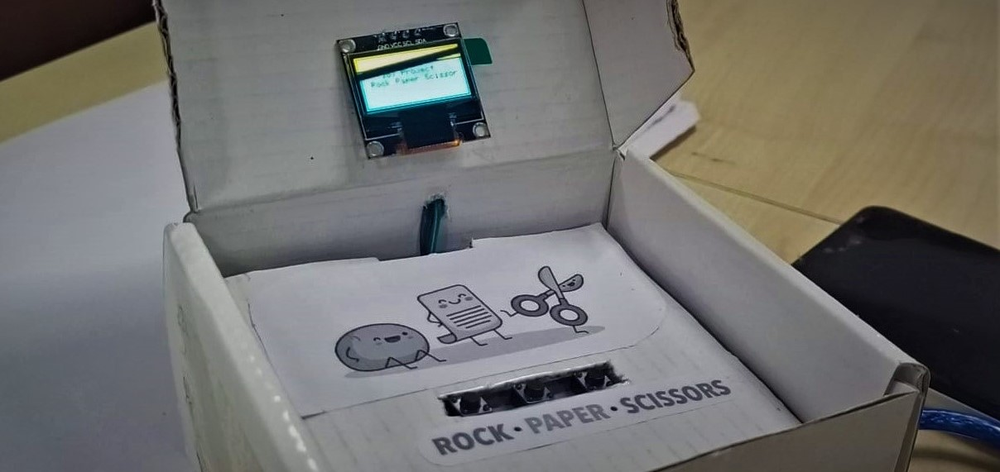

# RockPaperScissor-IoT
It's a mini game of Rock-Paper-Scissor, made using OLED Display and some buttons with Arduino Uno.

 {width=20%}

Read detailed explanation [here.](https://create.arduino.cc/projecthub/p-pavan/mini-game-35bca9 "Arduino Project Hub")
